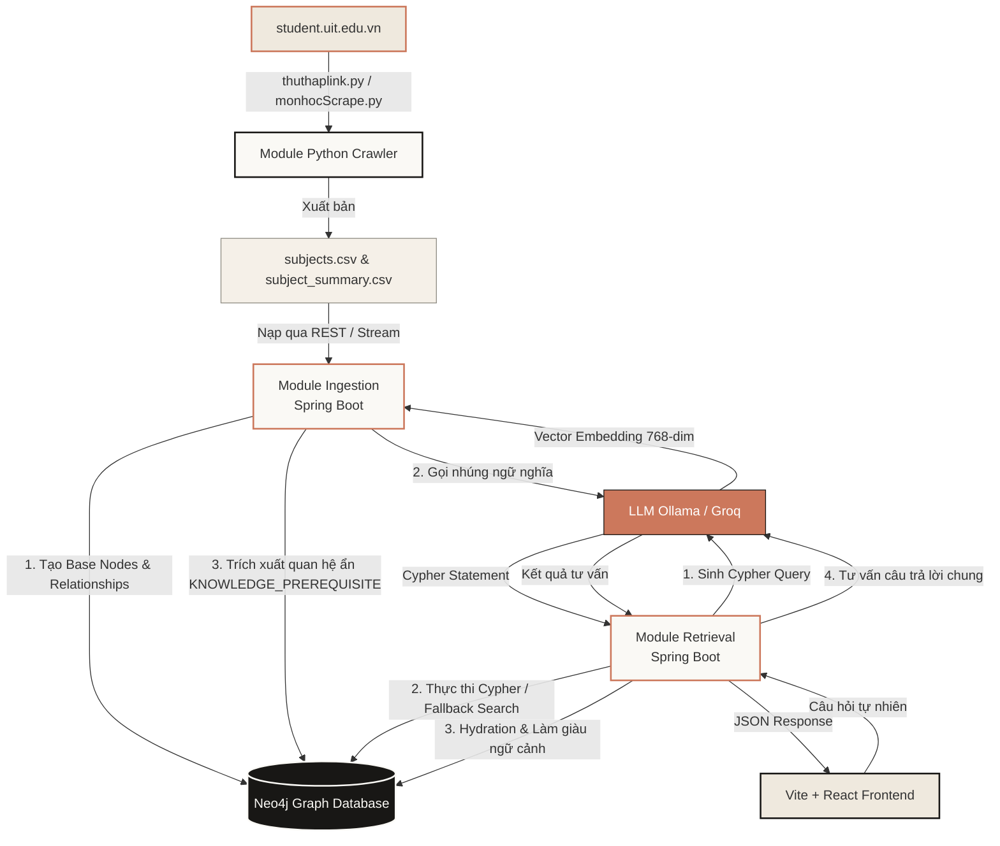
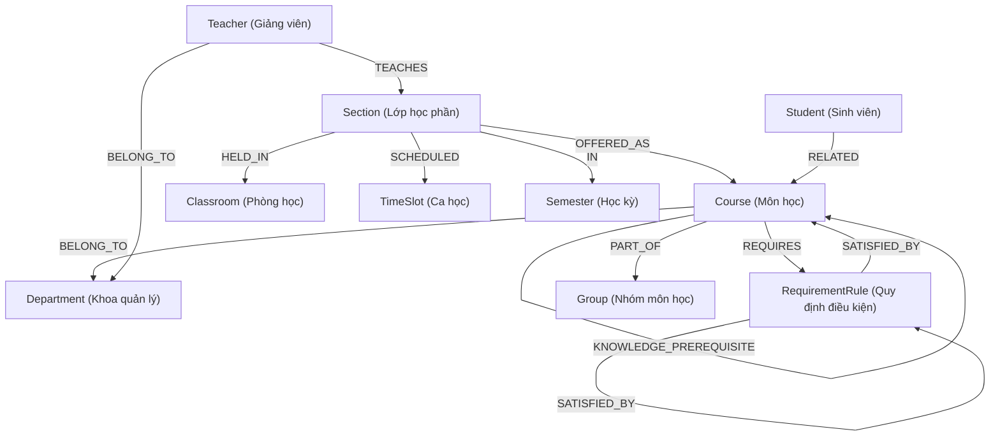

# HƯỚNG DẪN ÔN TẬP & BẢO VỆ KHÓA LUẬN TỐT NGHIỆP: DỰ ÁN UNIGRAPH 🎓🕸️

Tài liệu này tổng hợp toàn bộ nội dung dự án **UniGraph**, cấu trúc các module, công nghệ sử dụng, và chuẩn bị bộ câu hỏi phản biện giả định của giảng viên (Examiner Assumptions/Questions) kèm theo câu trả lời chi tiết phục vụ cho buổi bảo vệ khóa luận tốt nghiệp.

---

## PHẦN 1: TÓM TẮT DỰ ÁN UNIGRAPH

### 1. Giới thiệu đề tài & Mục tiêu nghiên cứu
*   **Tên đề tài:** *Xây dựng và khai thác Biểu đồ tri thức (Knowledge Graph) cho hệ thống Retrieval-Augmented Generation (RAG) trong lĩnh vực học thuật.*
*   **Lý do chọn đề tài:** Các hệ thống RAG truyền thống (Naive RAG) dựa trên tìm kiếm Vector (Vector Search) gặp hạn chế lớn khi trả lời các câu hỏi đa chặng (multi-hop) và dễ bị ảo giác (hallucination) do dữ liệu văn bản bị cắt nhỏ (chunking) làm mất tính liên kết logic. Lĩnh vực học thuật (chương trình đào tạo, môn tiên quyết, thời khóa biểu) đòi hỏi độ chính xác logic tuyệt đối.
*   **Giải pháp:** **UniGraph** kết hợp sức mạnh biểu diễn tri thức cấu trúc của **Knowledge Graph (Neo4j)** với khả năng lập luận của **LLM** qua mô hình **GraphRAG**, giúp truy xuất ngữ cảnh chính xác và nâng cao chất lượng tư vấn học tập.

### 2. Kiến trúc Hệ thống Tổng thể
Hệ thống được thiết kế theo dạng **Multi-module Gradle** viết bằng **Java 25** và **Spring Boot 4.0.4**, tách biệt rõ ràng giữa luồng nạp dữ liệu (Ingestion) và luồng khai thác truy vấn (Retrieval):



---

### 3. Sơ đồ thực thể Đồ thị (Neo4j Graph Schema)
Biểu đồ tri thức UniGraph biểu diễn cấu trúc học thuật của trường đại học thông qua 10 loại nút và các mối quan hệ ngữ nghĩa chặt chẽ:



---

### 4. Kết quả thực nghiệm & Đánh giá
Được kiểm chứng qua bộ dữ liệu thực nghiệm gồm **35 câu hỏi mẫu** phân bổ từ dễ đến khó (Level 1 đến Level 4), so sánh trực tiếp giữa **Naive RAG** và **GraphRAG**:

| Chỉ số đánh giá | Naive RAG (Vector Search) | GraphRAG (UniGraph) | Nhận xét & Đánh giá |
| :--- | :---: | :---: | :--- |
| **Độ chính xác Level 1** *(Tra cứu thuộc tính)* | **1.0** | **1.0** | Cả hai đều xuất sắc với các câu hỏi tra cứu thông tin đơn lẻ. |
| **Độ chính xác Level 2** *(Quan hệ 1-hop)* | 0.6 - 0.7 | **0.9 - 1.0** | Naive RAG bắt đầu thiếu sót do chunking làm mất liên kết phòng/giảng viên. |
| **Độ chính xác Level 3** *(Multi-hop / Logic)* | 0.2 - 0.4 | **0.8 - 0.9** | GraphRAG vượt trội nhờ truy vấn chính xác chuỗi điều kiện lồng nhau. |
| **Độ chính xác Level 4** *(Lộ trình / Toàn cảnh)* | 0.0 - 0.2 | **0.8** | Naive RAG hoàn toàn thất bại; GraphRAG tìm kiếm đường đi (Pathfinding) chính xác. |
| **Độ trễ trung bình (Latency)** | **~0.5s - 1.0s** | ~2.0s - 3.0s | GraphRAG chậm hơn do phải thực hiện quy trình 2 lượt LLM (Sinh Cypher + Trả lời). |

---

## PHẦN 2: BỘ CÂU HỎI PHẢN BIỆN GIẢ ĐỊNH & CÂU TRẢ LỜI CHI TIẾT

> [!IMPORTANT]
> Dưới đây là 12 câu hỏi mang tính cốt lõi mà Hội đồng chấm khóa luận thường đặt ra để đánh giá tư duy, kiến thức kỹ thuật và mức độ làm chủ công nghệ của sinh viên.

### 📋 NHÓM 1: CÂU HỎI VỀ KIẾN TRÚC & LỰA CHỌN CÔNG NGHỆ

#### ❓ Câu hỏi 1: Tại sao em lại chọn Cơ sở dữ liệu Đồ thị (Neo4j) thay vì Cơ sở dữ liệu quan hệ (RDBMS) hay Cơ sở dữ liệu Vector (Vector DB) thuần túy trong hệ thống RAG này?
*   **Ý đồ của Giảng viên:** Kiểm tra khả năng phân tích bài toán và so sánh các mô hình lưu trữ dữ liệu.
*   **Câu trả lời:**
    *   **So với RDBMS:** Dữ liệu học thuật chứa các mối quan hệ đan xen phức tạp (như lộ trình môn học, cây logic tiên quyết lồng nhau). Khi thực hiện truy vấn đa chặng (multi-hop) trên RDBMS, ta phải JOIN liên tiếp nhiều bảng lớn, dẫn đến suy giảm nghiêm trọng hiệu năng truy vấn. Neo4j lưu trữ trực tiếp các mối liên kết dưới dạng con trỏ vật lý trên đĩa (Index-free Adjacency), cho phép duyệt đồ thị (Graph Traversal) với độ trễ cực thấp bất kể độ sâu của truy vấn.
    *   **So với Vector DB thuần túy:** Vector DB hoạt động dựa trên tìm kiếm khoảng cách ngữ nghĩa (Cosine Similarity) trên các đoạn văn bản được cắt nhỏ (Chunks). Đối với các câu hỏi đòi hỏi tính logic cứng nhắc như *"Môn học tiên quyết của môn A là gì?"*, Vector DB thường trả về các môn học có đề cương tương đồng thay vì môn tiên quyết thực sự, hoặc bỏ sót do thông tin nằm ở các chunks khác nhau, gây ra hiện tượng ảo giác (Hallucination). Neo4j đảm bảo thông tin quan hệ logic chính xác 100%.

#### ❓ Câu hỏi 2: Em sử dụng phiên bản Java 25 và Spring Boot 4.0.4. Đây là những phiên bản rất mới. Lợi ích thực tế mà chúng mang lại cho dự án là gì?
*   **Ý đồ của Giảng viên:** Đánh giá tính cập nhật công nghệ và khả năng làm chủ hạ tầng mới.
*   **Câu trả lời:**
    *   **Virtual Threads (Project Loom):** Hỗ trợ đắc lực cho các tác vụ I/O blocking cao trong Ingestion và Retrieval. Khi hệ thống gọi API LLM (Ollama/Groq) hoặc truy vấn Neo4j, các luồng ảo (Virtual Threads) được giải phóng để xử lý các yêu cầu khác mà không làm nghẽn hệ thống phần cứng, giúp tối ưu hóa tài nguyên máy chủ.
    *   **Record Patterns & Pattern Matching:** Giúp mã nguồn xử lý các cấu trúc dữ liệu trả về phức tạp từ Neo4j (như Node, Relationship, Path) trở nên rõ ràng, an toàn về kiểu dữ liệu (type-safe) và giảm thiểu tối đa mã thừa (boilerplate code).
    *   **Tương thích tối đa với Spring AI & LangChain4j:** Tận dụng các thư viện tích hợp AI thế hệ mới nhất, giảm cấu trúc viết tay khi thiết lập kết nối Client, đảm bảo hiệu suất tốt và bảo mật cao.

#### ❓ Câu hỏi 3: Tại sao em lại tách biệt hệ thống thành 2 module riêng biệt là Ingestion và Retrieval? Chúng giao tiếp với nhau như thế nào?
*   **Ý đồ của Giảng viên:** Đánh giá tư duy thiết kế hệ thống lớn (System Design) và nguyên lý Separation of Concerns.
*   **Câu trả lời:**
    *   **Separation of Concerns:** 
        *   **Ingestion Module:** Là tác vụ xử lý hàng loạt (Batch Processing) rất nặng. Nó cào dữ liệu, xử lý văn bản, gọi mô hình LLM lớn để trích xuất quan hệ ẩn và sinh vector embeddings (tốn nhiều tài nguyên CPU, GPU, RAM). Tác vụ này chỉ chạy định kỳ (ví dụ: mỗi học kỳ một lần khi có chương trình đào tạo mới) và không cần online 24/7.
        *   **Retrieval Module:** Cần độ sẵn sàng cao (High Availability), phản hồi nhanh (Low Latency) để trực tiếp phục vụ yêu cầu tìm kiếm và chatbot của sinh viên thời gian thực.
    *   **Lợi ích:** Tránh việc chạy tiến trình nạp dữ liệu nặng làm sập hoặc nghẽn API phục vụ sinh viên. Hai module này độc lập về tài nguyên và giao tiếp gián tiếp qua cơ sở dữ liệu chung là **Neo4j** và chia sẻ các Domain Model định nghĩa sẵn trong module **Common**.

---

### 🗂️ NHÓM 2: CÂU HỎI VỀ THIẾT KẾ ĐỒ THỊ & QUY TRÌNH NẠP DỮ LIỆU (INGESTION)

#### ❓ Câu hỏi 4: Tại sao em lại thiết kế thực thể trung gian `RequirementRule` thay vì nối trực tiếp quan hệ `REQUIRES` giữa các Course? Thiết kế này có ưu điểm gì?
*   **Ý đồ của Giảng viên:** Đánh giá tư duy mô hình hóa đồ thị (Graph Modeling).
*   **Câu trả lời:**
    *   Trong thực tế, điều kiện đăng ký môn học của nhà trường không đơn thuần là *"Để học môn A thì cần học môn B"*. Nó thường có cấu trúc logic phức tạp, ví dụ: *"Để học môn A, sinh viên phải tích lũy môn B VÀ (môn C HOẶC môn D)"*.
    *   Nếu ta chỉ nối trực tiếp `(Course A)-[:REQUIRES]->(Course B)`, ta không thể biểu diễn được các cổng logic `AND`, `OR`, `NOT` hay các điều kiện lồng nhau.
    *   Bằng việc đưa vào thực thể trung gian **`RequirementRule`**, ta có thể thiết lập cấu trúc cây logic:
        *   Nút `Course A` kết nối tới `RequirementRule` (loại `AND`).
        *   Nút `RequirementRule` này lại được `SATISFIED_BY` bởi `Course B` và một `RequirementRule` con (loại `OR`).
        *   `RequirementRule` con lại được `SATISFIED_BY` bởi `Course C` và `Course D`.
    *   Thiết kế này giúp UniGraph mô hình hóa chính xác 100% mọi quy tắc đăng ký môn học phức tạp nhất của trường đại học.

```
(Course A) --[:REQUIRES]--> (Rule 1: AND)
                               |--[:SATISFIED_BY]--> (Course B)
                               |--[:SATISFIED_BY]--> (Rule 2: OR)
                                                        |--[:SATISFIED_BY]--> (Course C)
                                                        |--[:SATISFIED_BY]--> (Course D)
```

#### ❓ Câu hỏi 5: Trong Ingestion, làm thế nào em trích xuất được quan hệ ẩn `KNOWLEDGE_PREREQUISITE`? Làm sao để đảm bảo LLM không trích xuất sai lệch hoặc sinh ra mã môn học không tồn tại?
*   **Ý đồ của Giảng viên:** Đánh giá quy trình trích xuất thông tin (Information Extraction) và các biện pháp kiểm soát lỗi của LLM.
*   **Câu trả lời:**
    *   **Quy trình trích xuất:** Hệ thống lấy nội dung đề cương tóm tắt (`summary`) của môn học mục tiêu, sau đó gửi cho mô hình LLM lớn (`llama3-70b-8192` qua Groq) kèm danh sách toàn bộ các mã môn học hiện có trong cơ sở dữ liệu (`allCourseCodes`). LLM sẽ phân tích ngữ nghĩa đề cương để tìm các môn học nền tảng cần thiết.
    *   **Kiểm soát chất lượng trích xuất (Sanitization & Validation):**
        1.  **Prompt Constraint:** Ràng buộc chặt chẽ LLM trong Prompt chỉ được trả về các mã môn học nằm trong tập danh sách cung cấp sẵn, ngăn chặn việc LLM tự bịa ra mã môn (Hallucination).
        2.  **Strict Filtering ở Backend:** Kết quả dạng chuỗi từ LLM trả về sẽ được Backend Java phân tách (parse), làm sạch khoảng trắng, và thực hiện kiểm tra đối chiếu trực tiếp: `courseRepository.existsById(code)`. Hệ thống chỉ tạo quan hệ `KNOWLEDGE_PREREQUISITE` trên Neo4j nếu mã môn học đó thực sự tồn tại trong cơ sở dữ liệu.

#### ❓ Câu hỏi 6: Em sử dụng mô hình embedding nào để nhúng (embed) dữ liệu môn học? Tại sao ban đầu em thiết kế 1024 chiều nhưng sau đó lại đổi sang 768 chiều?
*   **Ý đồ của Giảng viên:** Đánh giá kiến thức về Vector Space, các mô hình Embedding và khả năng gỡ lỗi hệ thống.
*   **Câu trả lời:**
    *   Dự án sử dụng mô hình nhúng cục bộ **`embeddinggemma:latest`** chạy qua **Ollama**.
    *   **Lý do chuyển đổi chiều (Dimensions):** Ban đầu hệ thống định hình sử dụng chỉ mục vector 1024 chiều (tương thích với mô hình như BGE-M3). Tuy nhiên, khi chuyển sang chạy hoàn toàn cục bộ (local offline) để bảo mật dữ liệu học thuật và tiết kiệm chi phí, mô hình nhúng `embeddinggemma` của Ollama sinh ra vector biểu diễn có độ dài cố định là **768 chiều**.
    *   Để tránh lỗi không tương thích kích thước vector (dimension mismatch) khi Neo4j thực hiện tính toán độ đo tương đồng Cosine, em đã tạo file di cư schema `V002__update_embedding_dimension.cypher` để xóa chỉ mục cũ và định nghĩa lại Vector Index trên Neo4j với đúng cấu hình 768 chiều.

---

### 🔍 NHÓM 3: CÂU HỎI VỀ TRUY XUẤT TRI THỨC & SUY LUẬN (RETRIEVAL)

#### ❓ Câu hỏi 7: Em hãy giải thích chi tiết cơ chế hoạt động của thuật toán Hybrid Search trong hệ thống?
*   **Ý đồ của Giảng viên:** Đánh giá thuật toán cốt lõi của hệ thống RAG nâng cao.
*   **Câu trả lời:**
    *   Thuật toán Hybrid Search của UniGraph hoạt động qua các giai đoạn tuần tự để tối ưu hóa khả năng trích xuất tri thức:
        1.  **Giai đoạn 1 (Cypher Reasoning):** Hệ thống gửi câu hỏi người dùng đến LLM để dịch thành câu lệnh Cypher (Text-to-Cypher). Đồng thời sử dụng biểu thức chính quy (Regex) để trích xuất trực tiếp mã môn học xuất hiện trong câu hỏi (đảm bảo không bỏ sót thực thể).
        2.  **Giai đoạn 2 (Execution & Hydration):** Thực thi câu lệnh Cypher thu được trên Neo4j để lấy danh sách mã môn học. Sau đó thực hiện "Result Hydration" - nạp đầy đủ thông tin chi tiết của các môn học này từ database.
        3.  **Giai đoạn 3 (Fallback Search):** Nếu bước sinh Cypher gặp lỗi hoặc không tìm thấy môn học nào, hệ thống lập tức kích hoạt luồng dự phòng kết hợp:
            *   **Vector Search:** Nhúng câu hỏi thành vector 768 chiều và tìm kiếm top 5 môn học có độ tương đồng Cosine cao nhất trên Neo4j Vector Index.
            *   **Keyword Search:** Truy vấn các môn học có chứa từ khóa trong tên (sử dụng hàm `CONTAINS` trong Cypher).
            *   Gộp kết quả của cả hai phương pháp này và lọc trùng lặp.
        4.  **Giai đoạn 4 (Context Enrichment):** Thực hiện làm giàu ngữ cảnh bằng cách quét thêm các nút môn học lân cận trong vòng 1-hop trước khi gửi toàn bộ dữ liệu cấu trúc này sang cho LLM tư vấn.

#### ❓ Câu hỏi 8: Tại sao trong bước làm giàu ngữ cảnh (Context Enrichment), em lại giới hạn tối đa 5 môn lân cận cho mỗi môn học mục tiêu và tối đa 25 môn học cho toàn bộ ngữ cảnh?
*   **Ý đồ của Giảng viên:** Đánh giá hiểu biết của sinh viên về giới hạn của LLM (Context Window, Attention Mechanism) và chi phí vận hành.
*   **Câu trả lời:**
    *   **Hiện tượng bùng nổ đồ thị (Graph Explosion):** Đồ thị tri thức học thuật có mật độ liên kết rất cao (một môn học liên kết với nhiều môn tiên quyết, môn học trước, giảng viên, lớp học phần). Nếu không giới hạn, việc truy vấn lân cận 1-hop hoặc 2-hop của nhiều thực thể có thể kéo theo hàng trăm nút khác nhau vào ngữ cảnh.
    *   **Hậu quả nếu không giới hạn:**
        1.  **Lost in the Middle:** Khi ngữ cảnh đưa vào LLM quá dài và loãng, mô hình ngôn ngữ lớn sẽ bị bão hòa thông tin, dẫn tới việc bỏ sót hoặc không chú ý đúng vào thông tin cốt lõi nằm ở giữa ngữ cảnh.
        2.  **Vượt quá cửa sổ ngữ cảnh (Context Window Limit):** Gây lỗi tràn bộ nhớ hoặc từ chối dịch vụ của API.
        3.  **Latency & Cost:** Số lượng token quá lớn làm tăng thời gian sinh từ của LLM và tiêu tốn nhiều chi phí API.
    *   Do đó, giới hạn cứng 5 lân cận/môn và tổng 25 môn là tỷ lệ tối ưu đã qua thực nghiệm để cung cấp vừa đủ thông tin logic mà không làm loãng ngữ cảnh.

#### ❓ Câu hỏi 9: Nếu mô hình LLM sinh ra câu lệnh Cypher bị sai cú pháp hoặc không tối ưu làm treo cơ sở dữ liệu, hệ thống của em xử lý như thế nào?
*   **Ý đồ của Giảng viên:** Đánh giá khả năng dự phòng lỗi (Error Handling) và độ tin cậy của phần mềm (Software Reliability).
*   **Câu trả lời:**
    *   **Bọc xử lý ngoại lệ (Exception Catching):** Toàn bộ luồng sinh và thực thi Cypher được đặt trong khối `try-catch`. Nếu có bất kỳ ngoại lệ nào xảy ra (lỗi cú pháp Cypher, lỗi kết nối cơ sở dữ liệu), hệ thống sẽ ghi nhận log lỗi chi tiết (`log.error`) mà không làm sập ứng dụng.
    *   **Kích hoạt Fallback Search tự động:** Ngay khi bắt được ngoại lệ, hệ thống tự động chuyển sang luồng dự phòng **Fallback Search** (Vector Search + Keyword Search). Giao diện người dùng vẫn nhận được câu trả lời phản hồi chính xác dựa trên độ tương đồng ngữ nghĩa.
    *   **Ràng buộc thời gian thực thi (Timeout):** Thiết lập cấu hình timeout cho các truy vấn Neo4j để đảm bảo nếu LLM sinh ra các câu lệnh Cypher chứa vòng lặp vô hạn hoặc truy vấn đệ quy quá nặng, cơ sở dữ liệu sẽ tự động ngắt kết nối sau một khoảng thời gian ngắn (ví dụ: 5 giây), tránh làm nghẽn tài nguyên máy chủ.

---

### 📊 NHÓM 4: CÂU HỎI VỀ THỰC NGHIỆM & ĐÁNH GIÁ (EVALUATION)

#### ❓ Câu hỏi 10: Quy trình đánh giá (Evaluation) của em được thực hiện như thế nào? Tại sao em chọn đánh giá bằng LLM (LLM-as-a-Judge) thay vì các phương pháp truyền thống?
*   **Ý đồ của Giảng viên:** Kiểm tra phương pháp luận nghiên cứu khoa học và tính khách quan của thực nghiệm.
*   **Câu trả lời:**
    *   **Quy trình đánh giá:** 
        1.  Tự động sinh ngẫu nhiên bộ dữ liệu gồm 35 câu hỏi từ dữ liệu đồ thị thực tế bằng script Python `generate_eval_dataset.py`, phân đều ra 4 cấp độ phức tạp.
        2.  Chạy script `run_evaluation_resumable.py` để gửi các câu hỏi này đến hệ thống, ghi nhận câu trả lời thực tế từ GraphRAG và Naive RAG.
        3.  Sử dụng một mô hình LLM độc lập đóng vai trò giám khảo (Judge) đọc câu hỏi, đáp án chuẩn (ground truth) và câu trả lời của hệ thống để chấm điểm theo thang điểm từ 0 đến 1 dựa trên các tiêu chí: tính chính xác, tính đầy đủ của thực thể và quan hệ.
    *   **Lý do chọn LLM-as-a-Judge:** Các phương pháp truyền thống như BLEU hoặc ROUGE chỉ so sánh sự trùng lặp từ vựng (N-gram overlap). Trong tác vụ tư vấn học thuật, cùng một câu trả lời có thể được diễn đạt bằng nhiều cách khác nhau nhưng vẫn giữ nguyên giá trị ngữ nghĩa. LLM có khả năng đọc hiểu ngữ nghĩa sâu sắc, giúp đánh giá chính xác độ đúng đắn về mặt logic của câu trả lời mà các bộ đo so khớp từ vựng truyền thống không thể thực hiện được.

#### ❓ Câu hỏi 11: Đánh đổi lớn nhất của GraphRAG là thời gian phản hồi (latency) cao hơn Naive RAG. Em đề xuất các giải pháp khả thi nào để tối ưu hóa latency cho hệ thống khi đưa vào thực tế?
*   **Ý đồ của Giảng viên:** Đánh giá khả năng tối ưu hóa hiệu năng hệ thống khi triển khai thực tế (Production Readiness).
*   **Câu trả lời:**
    *   **Giải pháp 1: Cypher Query Caching:** Sử dụng bộ nhớ đệm (như Redis). Khi người dùng gửi câu hỏi, ta nhúng vector câu hỏi và tìm trong cache các câu hỏi tương đồng đã có sẵn Cypher query được tối ưu hóa. Điều này giúp bỏ qua lượt gọi LLM thứ nhất (Text-to-Cypher), giảm ngay ~1.5s độ trễ.
    *   **Giải pháp 2: Sử dụng LLM nhỏ chuyên biệt (Specialize/Fine-tuned LLM):** Thay vì sử dụng mô hình đa năng lớn để sinh Cypher, ta có thể fine-tune một mô hình nhỏ gọn (ví dụ: Llama-3-8B hoặc Qwen-7B) chuyên cho tác vụ dịch Text-to-Cypher. Mô hình này có thể chạy cục bộ trên phần cứng tầm trung với tốc độ sinh từ cực nhanh.
    *   **Giải pháp 3: Trích xuất song song (Parallel Ingestion/Retrieval):** Sử dụng cơ chế lập trình bất đồng bộ của Java để kích hoạt các tìm kiếm fallback và Regex song song trong khi LLM sinh Cypher.

#### ❓ Câu hỏi 12: Đề tài của em hiện tại có những hạn chế gì và hướng phát triển tiếp theo của em là gì?
*   **Ý đồ của Giảng viên:** Đánh giá cái nhìn thực tế và tầm nhìn mở rộng nghiên cứu của sinh viên.
*   **Câu trả lời:**
    *   **Hạn chế hiện tại:**
        *   Tỷ lệ sinh Cypher chính xác phụ thuộc nhiều vào chất lượng Prompt và năng lực của LLM.
        *   Chưa áp dụng các thuật toán phân tích đồ thị toàn cục (Global Reasoning). Hệ thống hiện tại giải quyết rất tốt các câu hỏi cục bộ (Local Search) nhưng chưa tối ưu cho các câu hỏi mang tính tổng quan như *"Nhận xét chung về chương trình đào tạo ngành Công nghệ phần mềm?"*.
    *   **Hướng phát triển tiếp theo:**
        1.  **Áp dụng thuật toán phát hiện cộng đồng (Community Detection):** Sử dụng các thuật toán như Louvain hoặc Leiden trên Neo4j để chia đồ thị môn học thành các phân khu kiến thức. Sau đó sinh các bản tóm tắt cộng đồng (Community Summaries). Điều này giúp hệ thống trả lời được các câu hỏi mang tính vĩ mô tốt hơn (theo hướng tiếp cận của Microsoft GraphRAG).
        2.  **Fine-tuning mô hình dịch Cypher chuyên biệt** để tăng độ chính xác lên trên 98% và giảm thời gian phản hồi.
        3.  **Tích hợp cơ chế chấm điểm và phản hồi từ sinh viên** để xây dựng tập dữ liệu tinh chỉnh RLHF giúp hệ thống ngày càng thông minh hơn.

---

## PHẦN 3: CHIẾN THUẬT & MẸO TRẢ LỜI PHẢN BIỆN KHI BẢO VỆ

> [!TIP]
> Để đạt điểm tối đa từ Hội đồng chấm khóa luận, hãy áp dụng các nguyên tắc ứng xử sau:

1.  **Thừa nhận và Đưa ra Giải pháp:** Khi giảng viên chỉ ra lỗi hoặc điểm chưa tối ưu (ví dụ: *"Sao không dùng Framework X mà lại viết tay?"*), tuyệt đối không cãi lý. Hãy trả lời theo cấu trúc: *"Dạ, ý kiến của Thầy/Cô rất chính xác. Trong phạm vi đồ án này, em chọn giải pháp hiện tại vì lý do [A]. Tuy nhiên, góp ý của Thầy/Cô là hướng đi rất tốt để em nâng cấp hệ thống ở giai đoạn tiếp theo bằng cách [B]."*
2.  **Nhấn mạnh vào Đóng góp Thực tế:** Hãy luôn hướng câu trả lời về kết quả thực nghiệm. Nhấn mạnh việc hệ thống đã giải quyết được **~30% độ chính xác cho câu hỏi đa chặng (multi-hop)** - điều mà các hệ thống RAG thông thường hiện nay tại trường học đang gặp bế tắc.
3.  **Tự tin về Công nghệ mới:** Việc sử dụng **Java 25** và **Spring Boot 4** là điểm cộng rất lớn về tính cập nhật công nghệ. Hãy nêu rõ đây là sự chuẩn bị đón đầu xu hướng phát triển phần mềm trong các năm tới.
4.  **Minh họa bằng Đồ thị:** Nếu có thể, hãy vẽ sẵn hoặc chiếu sơ đồ cấu trúc `RequirementRule` lồng nhau để giải thích. Hình ảnh trực quan sẽ thuyết phục hơn hàng vạn lời nói giải thích logic.

---
Chúc bạn có một buổi bảo vệ khóa luận thành công rực rỡ với điểm số tối đa! 🚀🎓
