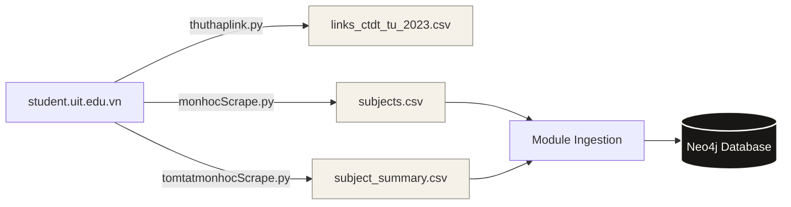

# Tài liệu 2: Quy trình Thu thập & Nhập liệu Đồ thị (UniGraph)

Tài liệu này chi tiết hóa quy trình thu thập dữ liệu học thuật từ cổng thông tin sinh viên UIT và cơ chế chuyển đổi các tệp CSV thô thành cơ sở dữ liệu đồ thị tri thức phong phú thông qua module Ingestion viết bằng Java Spring Boot.

---

## 1. Quy trình Thu thập Dữ liệu (Python Scrapers)

Module cào dữ liệu được viết bằng Python nằm trong thư mục [crawl/](file:///home/dang-phong/Desktop/MyProject/UniGraph/crawl) bao gồm 3 scraper chuyên biệt:



### 1.1. Thu thập liên kết chương trình đào tạo (`thuthaplink.py`)
- **Tệp nguồn:** [thuthaplink.py](file:///home/dang-phong/Desktop/MyProject/UniGraph/crawl/thuthaplink.py)
- **Mục tiêu:** Thu thập các liên kết tài liệu chương trình đào tạo (CTĐT) từ năm 2023 trở đi từ trang chủ UIT.
- **Cách thức hoạt động:** Sử dụng `BeautifulSoup` duyệt qua các phần tử `div.acc-item` (accordion). Sử dụng biểu thức chính quy (Regex) `re.search(r'20\d{2}', header_text)` lọc các khóa tuyển sinh từ năm 2023. Trích xuất tên chương trình học, đường dẫn và lưu trữ thành bảng liên kết.

### 1.2. Trích xuất danh mục môn học (`monhocScrape.py`)
- **Tệp nguồn:** [monhocScrape.py](file:///home/dang-phong/Desktop/MyProject/UniGraph/crawl/monhocScrape.py)
- **Mục tiêu:** Cào bảng danh mục toàn bộ môn học chính quy của UIT.
- **Kỹ thuật xử lý đặc biệt cho AI:**
  Dữ liệu môn tiên quyết trong bảng thường chứa nhiều môn phân cách bằng dấu xuống dòng hoặc các thẻ `<br/>`. Để đảm bảo LLM sau này có thể đọc hiểu và chuyển đổi chính xác các điều kiện logic lồng nhau (AND/OR), Scraper cài đặt hàm tiền xử lý `get_ai_friendly_text`:
  ```python
  def get_ai_friendly_text(cell):
      # Thay thế toàn bộ thẻ <br/> thành ký tự xuống dòng thực tế \n
      for br in cell.find_all("br"):
          br.replace_with("\n")
      
      # Tách và làm sạch khoảng trắng thừa ở mỗi dòng
      lines = [line.strip() for line in cell.get_text().splitlines() if line.strip()]
      return "\n".join(lines)
  ```
  Nhờ đó, dữ liệu trong tệp [subjects.csv](file:///home/dang-phong/Desktop/MyProject/UniGraph/crawl/subjects.csv) giữ nguyên được cấu trúc phân dòng rõ ràng cho các cột `prerequisite_course_codes` và `previous_course_codes`.

### 1.3. Cào tóm tắt đề cương môn học (`tomtatmonhocScrape.py`)
- **Tệp nguồn:** [tomtatmonhocScrape.py](file:///home/dang-phong/Desktop/MyProject/UniGraph/crawl/tomtatmonhocScrape.py)
- **Mục tiêu:** Cào tóm tắt nội dung chính (syllabus summaries) của các môn học.
- **Đầu ra:** Xuất ra tệp [subject_summary.csv](file:///home/dang-phong/Desktop/MyProject/UniGraph/crawl/subject_summary.csv) chứa mã môn học, tên môn tiếng Việt và văn bản tóm tắt mô tả nội dung học thuật.

---

## 2. Module Ingestion (Java Spring Boot + LangChain4j)

Quy trình nhập liệu và xây dựng đồ thị trong [CsvIngestionServiceImpl.java](file:///home/dang-phong/Desktop/MyProject/UniGraph/ingestion/src/main/java/com/uni_graph/ingestion/service/impl/CsvIngestionServiceImpl.java) được chia làm **3 bước (Passes)** tối ưu để thiết lập các nút và quan hệ chính xác:

### 2.1. Bước 1: Khởi tạo các Node Cơ sở & Vector Embeddings
Module đọc qua từng dòng trong tệp `subjects.csv` để khởi tạo các node [Course](file:///home/dang-phong/Desktop/MyProject/UniGraph/common/src/main/java/com/uni_graph/common/domain/Course.java) và [Department](file:///home/dang-phong/Desktop/MyProject/UniGraph/common/src/main/java/com/uni_graph/common/domain/Department.java).

- **Thiết lập Khoa:** Các tên khoa được lưu đệm trong cache để tránh ghi trùng lặp:
  ```java
  Department department = departmentCache.computeIfAbsent(departmentName, k -> {
      Department d = new Department();
      d.setName(k);
      return departmentRepository.save(d);
  });
  ```
- **Xây dựng Văn bản làm Embeddings:** Hệ thống xây dựng một chuỗi văn bản mô tả giàu ngữ nghĩa cho môn học:
  ```java
  // Định nghĩa trong LangChainEmbeddingServiceImpl.java
  public String buildTextToEmbed(Course course) {
      StringBuilder sb = new StringBuilder();
      sb.append(String.format("Môn học: %s (%s). Mã môn: %s. ", course.getTitleVn(), course.getTitleEn(), course.getCode()));
      if (course.getDepartment() != null) {
          sb.append(String.format("Thuộc sự quản lý của: %s. ", course.getDepartment().getName()));
      }
      sb.append(String.format("Loại môn: %s. Số tín chỉ: %d lý thuyết, %d thực hành. ", course.getCourseType(), course.getTheoryCredits(), course.getPracticeCredits()));
      if (course.getSummary() != null) {
          sb.append(String.format("Nội dung chính: %s", course.getSummary()));
      }
      return sb.toString().trim();
  }
  ```
- **Tạo chỉ mục Vector:** Gọi mô hình `OllamaEmbeddingModel` để tạo vector 768 chiều và gán vào thuộc tính `embedding` của Course, sau đó lưu nút Course xuống Neo4j.

### 2.2. Bước 2: Thiết lập các Mối quan hệ Tường minh (Explicit Relations)
Hệ thống quét tệp dữ liệu lần thứ hai để xử lý các liên kết quan hệ cấu trúc học thuật:

1. **Môn học Tương đương (`EQUIVALENT_TO`):**
   Phân tách danh sách các mã môn tương đương và tạo liên kết trực tiếp giữa các Course:
   ```java
   parseCodes(line[8]).forEach(eqCode -> {
       courseRepository.findById(eqCode).ifPresent(eqCourse -> {
           course.getEquivalentCourses().add(eqCourse);
       });
   });
   ```

2. **Môn học Tiên quyết & Môn học Trước (`RequirementRule`):**
   Để biểu diễn logic điều kiện tiên quyết (Prerequisite - bắt buộc hoàn thành trước) và môn học trước (Previous - đã học nhưng có thể chưa đạt), hệ thống khởi tạo các node trung gian [RequirementRule](file:///home/dang-phong/Desktop/MyProject/UniGraph/common/src/main/java/com/uni_graph/common/domain/RequirementRule.java):
   ```java
   List<String> preCodes = parseCodes(line[9]);
   if (!preCodes.isEmpty()) {
       RequirementRule rule = new RequirementRule();
       rule.setRuleType(RuleType.PREREQUISITE);
       rule.setLogicType(LogicType.AND); // Mặc định các môn xuống dòng cách nhau là logic AND
       preCodes.forEach(pCode -> {
           courseRepository.findById(pCode).ifPresent(pCourse -> {
               rule.getSatisfiedByCourses().add(pCourse);
           });
       });
       if (!rule.getSatisfiedByCourses().isEmpty()) {
           ruleRepository.save(rule);
           course.getRequirementRules().add(rule);
       }
   }
   ```
   *Cấu trúc này cho phép tạo các nhánh điều kiện lồng nhau (AND/OR) bằng cách liên kết `RequirementRule` -> `SATISFIED_BY` -> `RequirementRule` con.*

### 2.3. Bước 3: Nạp Tóm tắt & Trích xuất Quan hệ Ẩn bằng LLM
Dữ liệu đề cương môn học chứa các kiến thức nền tảng ẩn không được quy định cứng trong văn bản hành chính của nhà trường, nhưng cực kỳ hữu ích cho sinh viên. Hệ thống nhập dữ liệu từ `subject_summary.csv`:

1. **Cập nhật Summary & Tái nhúng Vector:** 
   Gán thuộc tính `summary` cho Course, sau đó xây dựng lại văn bản ngữ nghĩa và gọi API nhúng của Ollama để sinh lại thuộc tính `embedding` mới (tích hợp ngữ nghĩa sâu của đề cương).
2. **Trích xuất Kiến thức Nền tảng ẩn (`KNOWLEDGE_PREREQUISITE`):**
   Hệ thống gọi LLM (`llama3-70b-8192` qua Groq) để phân tích tóm tắt nội dung môn học và tự động phát hiện các môn học bổ trợ nền tảng cần có:
   ```java
   // Prompt trích xuất trong LangChainEmbeddingServiceImpl.java
   String prompt = String.format(
       "Dựa vào tóm tắt môn học sau: %s. Hãy liệt kê các mã môn học (từ danh sách: %s) mà sinh viên CẦN phải có kiến thức nền tảng trước khi học môn này. Chỉ trả về danh sách mã môn, phân cách bằng dấu phẩy. Nếu không có môn nào phù hợp, hãy trả về 'NONE'.",
       summary, String.join(", ", allCourseCodes)
   );
   ```
   Kết quả trả về từ LLM được lọc trùng, kiểm tra tồn tại hợp lệ trong danh sách mã môn của trường (`allCourseCodes`), và được tạo thành các quan hệ `KNOWLEDGE_PREREQUISITE` trực tiếp giữa các nút môn học trên Neo4j.

---

## 3. Cấu hình Trí tuệ Nhân tạo phục vụ Ingestion

Cấu hình AI cho module Ingestion nằm tại tệp [AiConfig.java](file:///home/dang-phong/Desktop/MyProject/UniGraph/ingestion/src/main/java/com/uni_graph/ingestion/config/AiConfig.java):
- **Embedding Model:** Khởi tạo `OllamaEmbeddingModel` cục bộ sử dụng model `embeddinggemma:latest` (768 dimensions) qua cổng mặc định `http://localhost:11434`.
- **Chat Model:** Khởi tạo `OllamaChatModel` kết nối với API Groq (dưới giao thức OpenAI-compatible tương thích cấu trúc URL) để chạy model lớn `llama3-70b-8192` phục vụ bóc tách quan hệ ẩn một cách chuẩn xác nhất với timeout là 120 giây.
