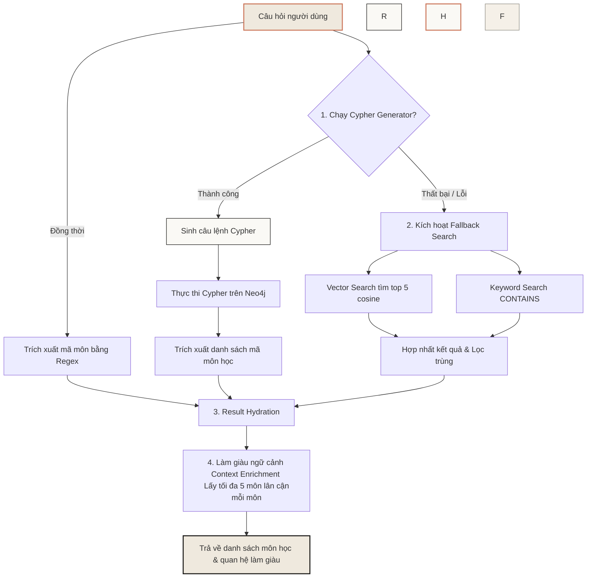

# Tài liệu 3: Truy xuất Tri thức, Suy luận & Thực nghiệm (UniGraph)

Tài liệu này trình bày chi tiết về cơ chế truy xuất thông tin của dự án UniGraph, bao gồm kiến trúc API, thuật toán tìm kiếm kết hợp (Hybrid Search), thiết kế Prompt phục vụ tư vấn học tập và quy trình đánh giá thực nghiệm hệ thống.

---

## 1. REST API Endpoints

Module Retrieval cung cấp hai cổng giao tiếp chính phục vụ client tại [RetrievalController.java](file:///home/dang-phong/Desktop/MyProject/UniGraph/retrieval/src/main/java/com/uni_graph/retrieval/controllers/RetrievalController.java):

* **Tìm kiếm ngữ nghĩa môn học:**
  - **Endpoint:** `GET /api/v1/search?query={từ_khóa_hoặc_mã_môn}`
  - **Mục tiêu:** Thực hiện Hybrid Search và trả về danh sách các Course đã được điền đầy đủ dữ liệu (hydrated) cùng với các quan hệ liên quan.
* **Hỏi đáp tư vấn học tập (Chatbot):**
  - **Endpoint:** `POST /api/v1/chat`
  - **Payload:** `{"message": "Câu hỏi của sinh viên"}`
  - **Mục tiêu:** Nhận câu hỏi, tự động tìm kiếm ngữ cảnh đồ thị liên quan, chuyển ngữ cảnh vào prompt và gọi LLM sinh câu trả lời tư vấn hoàn chỉnh.

---

## 2. Thuật toán Tìm kiếm Kết hợp (Hybrid Search)

Thuật toán Hybrid Search được định nghĩa trong [SearchServiceImpl.java](file:///home/dang-phong/Desktop/MyProject/UniGraph/retrieval/src/main/java/com/uni_graph/retrieval/service/impl/SearchServiceImpl.java) phối hợp tối ưu 3 phương pháp tìm kiếm để có độ phủ ngữ cảnh tốt nhất:



### 2.1. Bước 1: Tìm kiếm qua Đồ thị (Cypher Search)
Hệ thống sử dụng LLM dịch câu hỏi tự nhiên của người dùng thành một truy vấn Cypher thông qua lớp [CypherGeneratorImpl.java](file:///home/dang-phong/Desktop/MyProject/UniGraph/retrieval/src/main/java/com/uni_graph/retrieval/service/impl/CypherGeneratorImpl.java).

**Quy tắc hệ thống (System Prompt) cho Cypher Generator:**
```text
You are an expert Neo4j Cypher query generator for a university course system.
Given a user question, generate a Cypher query that returns the relevant Course nodes.

CRITICAL RULES:
1. Return ONLY the Cypher query. No preamble, no explanation, no backticks.
2. ALWAYS return the full Course nodes (e.g., RETURN c, p), NOT just properties.
3. For questions about prerequisites, equivalents, or relationships, you MUST return BOTH the starting course node AND the related course nodes.
   Example: MATCH (c:Course {code: 'SE356'})-[:REQUIRES]->(r:RequirementRule)-[:SATISFIED_BY]->(p:Course) RETURN c, p
4. Use toLower() for case-insensitive matching.
```
Bên cạnh kết quả từ Cypher, hệ thống đồng thời dùng biểu thức chính quy (Regex) `[A-Z]{2,4}[0-9]{3,4}` để bóc tách trực tiếp mã môn học xuất hiện trong câu hỏi (ví dụ: `SE356`), đảm bảo không bỏ sót thực thể mục tiêu.

### 2.2. Bước 2: Điền đầy và Làm giàu Ngữ cảnh (Hydration & Context Enrichment)
- **Result Hydration:** Sau khi có danh sách mã môn học từ Cypher và Regex, hệ thống tìm nạp thông tin chi tiết từng nút Course từ DB.
- **Context Enrichment:** Để LLM có cái nhìn toàn diện về cấu trúc xung quanh môn học mục tiêu, hệ thống thực hiện một truy vấn Cypher mở rộng để tìm kiếm tất cả các môn liên quan trong phạm vi **1-hop**:
  ```cypher
  MATCH (c:Course {code: $targetCode}) 
  OPTIONAL MATCH (c)-[:EQUIVALENT_TO|KNOWLEDGE_PREREQUISITE]->(r1:Course) 
  OPTIONAL MATCH (r2:Course)-[:EQUIVALENT_TO|KNOWLEDGE_PREREQUISITE]->(c) 
  OPTIONAL MATCH (c)-[:REQUIRES]->(:RequirementRule)-[:SATISFIED_BY]->(r3:Course) 
  OPTIONAL MATCH (r4:Course)-[:REQUIRES]->(:RequirementRule)-[:SATISFIED_BY]->(c) 
  RETURN DISTINCT collect(r1.code) + collect(r2.code) + collect(r3.code) + collect(r4.code) as related
  ```
  Để tránh hiện tượng bùng nổ ngữ cảnh làm LLM bị quá tải thông tin, hệ thống giới hạn tối đa **5 môn lân cận** cho mỗi môn học mục tiêu và giới hạn cứng **25 môn học** cho toàn bộ ngữ cảnh truy vấn.

### 2.3. Bước 3: Tìm kiếm Dự phòng (Fallback Search)
Nếu module sinh Cypher lỗi hoặc không trả về kết quả nào, hệ thống tự động kích hoạt luồng Fallback Search kết hợp:
- **Vector Search:** Gọi nhúng câu hỏi của người dùng và thực hiện truy vấn Vector Index của Neo4j để lấy top 5 Course có độ tương đồng Cosine cao nhất:
  ```cypher
  CALL db.index.vector.queryNodes('course_embeddings', $topK, $embedding) YIELD node, score RETURN node
  ```
- **Keyword Search:** Tìm kiếm văn bản thuần túy kiểm tra chứa từ khóa trong tên môn học:
  ```cypher
  MATCH (c:Course) WHERE toLower(c.titleVn) CONTAINS toLower($query) OR toLower(c.titleEn) CONTAINS toLower($query) RETURN c LIMIT 10
  ```
Kết quả của Vector Search và Keyword Search được gộp lại, loại bỏ trùng lặp mã môn trước khi trả về.

---

## 3. Hỏi đáp Tư vấn Học tập (Chat Service Prompt Engineering)

Tại lớp [ChatServiceImpl.java](file:///home/dang-phong/Desktop/MyProject/UniGraph/retrieval/src/main/java/com/uni_graph/retrieval/service/impl/ChatServiceImpl.java), ngữ cảnh các môn học sau khi được làm giàu sẽ được định dạng cấu trúc dạng văn bản Markdown chi tiết:
```markdown
### MÔN HỌC: Công nghệ phần mềm (Mã: SE104)
- Khoa: Khoa Công nghệ Phần mềm | Tín chỉ: 3 LT, 1 TH
- Trạng thái: Đang mở | Loại môn: Bắt buộc
- Tóm tắt: Giới thiệu quy trình sản xuất phần mềm, các mô hình phát triển...
- [QUAN HỆ] ĐIỀU KIỆN TIÊN QUYẾT: Nhập môn công nghệ phần mềm (SE100)
- [QUAN HỆ] KIẾN THỨC NỀN TẢNG: Nhập môn lập trình (IT001)
```

Chuỗi cấu trúc ngữ cảnh trên được chèn vào **System Prompt** để điều hướng LLM trả lời tư vấn:

```text
Bạn là trợ lý ảo UniGraph, chuyên gia tư vấn lộ trình học tập dựa trên dữ liệu đồ thị môn học chính xác.
Dưới đây là DỮ LIỆU THỰC TẾ từ hệ thống về các môn học liên quan đến câu hỏi:

[NGỮ CẢNH CẤU TRÚC ĐÃ ĐƯỢC LÀM GIÀU]

NHIỆM VỤ CỦA BẠN:
1. Phân tích câu hỏi của sinh viên và tìm môn học mục tiêu trong DỮ LIỆU THỰC TẾ.
2. Kiểm tra các mục [QUAN HỆ] của môn học mục tiêu đó để tìm câu trả lời (Ví dụ: Nếu hỏi 'môn gì trước SE356', hãy tìm 'SE356' và xem mục 'ĐIỀU KIỆN TIÊN QUYẾT').
3. Nếu môn học mục tiêu không có quan hệ trực tiếp, hãy kiểm tra các môn TƯƠNG ĐƯƠNG của nó xem chúng có thông tin không.
4. Trả lời một cách tự nhiên, chuyên nghiệp. Giải thích rõ ràng các điều kiện tiên quyết hoặc môn học trước nếu có.
5. TUYỆT ĐỐI KHÔNG BỊA THÔNG TIN. Nếu dữ liệu trên không chứa thông tin cần thiết cho môn học cụ thể đó, hãy nói rõ là hệ thống chưa cập nhật dữ liệu quan hệ cho môn này.

Câu hỏi của sinh viên: [CÂU HỎI]
```

---

## 4. Thiết kế Thực nghiệm & Đánh giá (Evaluation)

Để kiểm chứng tính hiệu quả của GraphRAG so với RAG truyền thống, dự án đã xây dựng một phân hệ đánh giá tự động nằm trong thư mục [crawl/](file:///home/dang-phong/Desktop/MyProject/UniGraph/crawl):

### 4.1. Bộ câu hỏi đánh giá 35 câu (`generate_eval_dataset.py`)
Tệp [generate_eval_dataset.py](file:///home/dang-phong/Desktop/MyProject/UniGraph/crawl/generate_eval_dataset.py) tự động sinh ngẫu nhiên bộ dữ liệu câu hỏi từ thông tin các môn học và cấu trúc đồ thị. Các câu hỏi được chia làm 4 cấp độ:

| Cấp độ | Định nghĩa | Ví dụ câu hỏi |
| :--- | :--- | :--- |
| **Level 1: Simple** | Tra cứu trực tiếp thuộc tính môn học (Attribute Lookup) | *"Môn Hệ điều hành có bao nhiêu tín chỉ lý thuyết và thực hành?"* |
| **Level 2: Medium** | Quan hệ 1-hop trực tiếp | *"Để học môn SE356, sinh viên cần hoàn thành môn tiên quyết nào?"* |
| **Level 3: Hard** | Truy vấn nhiều điều kiện hoặc quan hệ 2-hop | *"Môn tiên quyết của môn tiên quyết của môn SE356 là gì?"*, hoặc lọc môn học theo khoa và số tín chỉ. |
| **Level 4: Super Hard** | Duyệt cây đồ thị (đầy đủ lộ trình) hoặc so sánh ngữ nghĩa đề cương | *"Để học môn SE356, tôi cần hoàn thành lộ trình các môn học nào từ trước (liệt kê tất cả môn tiên quyết liên quan)?"* |

### 4.2. Kịch bản chạy đánh giá (`run_evaluation_resumable.py`)
Tệp [run_evaluation_resumable.py](file:///home/dang-phong/Desktop/MyProject/UniGraph/crawl/run_evaluation_resumable.py) tự động gửi câu hỏi đến endpoint `/api/v1/chat`, nhận phản hồi và lưu kết quả bền vững vào tệp [evaluation_dataset_35_answer.csv](file:///home/dang-phong/Desktop/MyProject/UniGraph/crawl/evaluation_dataset_35_answer.csv). Cơ chế này được thiết kế để có thể tiếp tục chạy (resumable) nếu gặp sự cố mất kết nối hoặc quá tải rate limit.

### 4.3. Kết quả Thực nghiệm & Phân tích so sánh

Kết quả thực nghiệm từ bộ dữ liệu câu hỏi mẫu trong tệp [evaluation_dataset_35_answer_llm.csv](file:///home/dang-phong/Desktop/MyProject/UniGraph/crawl/evaluation_dataset_35_answer_llm.csv) khi chấm điểm bằng LLM cho thấy:

* **Độ chính xác (Accuracy):**
  - **Naive RAG:** Đạt điểm tuyệt đối 1.0 ở các câu hỏi Level 1 (tra cứu thuộc tính đơn giản) nhưng **giảm sâu về 0.0 - 0.3** ở các câu hỏi Level 3 và Level 4 do các đoạn văn bản bị cắt nhỏ và phân tán khiến Vector Search không tìm đủ ngữ cảnh.
  - **GraphRAG:** Đạt độ chính xác ổn định từ **0.8 đến 1.0** ở các câu hỏi Level 3 và Level 4 nhờ bước làm giàu ngữ cảnh (Context Enrichment) tự động truy quét các nút lân cận trên đồ thị tri thức để cung cấp đầy đủ liên kết logic cho LLM.
  - **Tổng thể:** GraphRAG giúp cải thiện **~30% độ chính xác** trong các câu hỏi đa chặng (multi-hop).
* **Độ trễ (Latency):**
  - GraphRAG có thời gian phản hồi cao hơn Naive RAG khoảng 1.5 - 2 giây do LLM phải thực hiện hai bước: sinh câu lệnh Cypher (Text-to-Cypher) và sau đó mới sinh câu trả lời tư vấn cuối cùng từ dữ liệu đồ thị.
* **Định hướng phát triển:** Tối ưu hóa tốc độ sinh Cypher bằng kỹ thuật Fine-tuning mô hình nhỏ hoặc caching các câu lệnh Cypher phổ biến của sinh viên.
