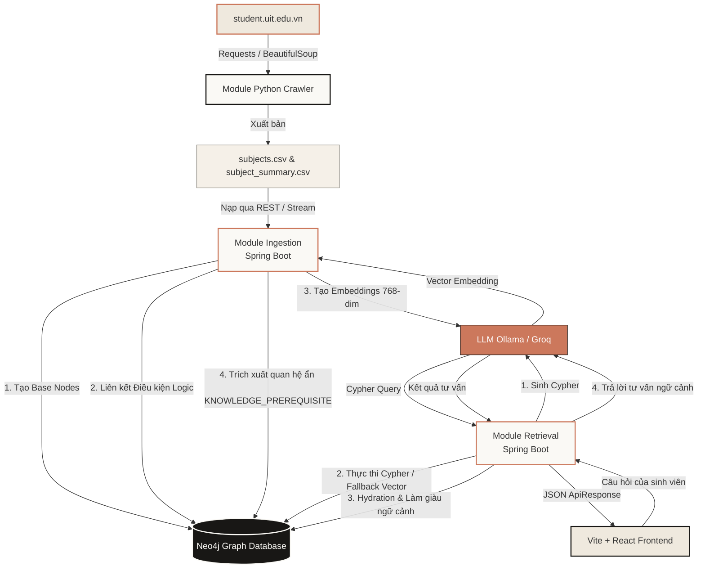
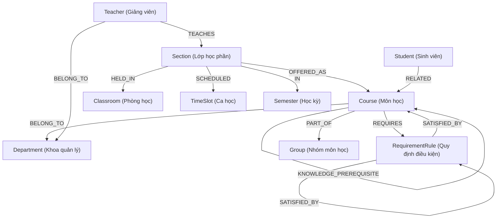

# Tài liệu 1: Tổng quan Hệ thống & Thiết kế Cơ sở dữ liệu Đồ thị (UniGraph)

Tài liệu này cung cấp cái nhìn tổng quan về mục tiêu dự án, kiến trúc hệ thống tổng thể và thiết kế chi tiết của cơ sở dữ liệu đồ thị tri thức Neo4j được sử dụng trong dự án UniGraph.

---

## 1. Giới thiệu Đề tài & Mục tiêu Nghiên cứu

### 1.1. Lý do chọn đề tài
Trong lĩnh vực học thuật, việc truy xuất thông tin đào tạo (như lộ trình học tập, thông tin môn học tiên quyết, môn tương đương, hoặc phân công giảng dạy) đòi hỏi độ chính xác tuyệt đối và khả năng liên kết logic cao. 

Các hệ thống **Retrieval-Augmented Generation (RAG) truyền thống (Naive RAG)** dựa trên việc cắt nhỏ văn bản và tìm kiếm vector (Vector Search) thường gặp các hạn chế lớn:
- **Hiện tượng ảo giác (Hallucination):** LLM sinh ra thông tin không có thực do dữ liệu ngữ cảnh lấy từ Vector Search bị đứt gãy, thiếu tính liên kết logic.
- **Không có khả năng truy vấn đa chặng (Multi-hop Reasoning):** Ví dụ với câu hỏi: *"Môn học tiên quyết của môn học tiên quyết của môn Y là gì?"*, Naive RAG rất khó truy tìm chính xác chuỗi liên kết này do các đoạn văn bản nằm phân tán.

**Giải pháp GraphRAG (Knowledge Graph RAG):**
Bằng cách xây dựng một **Biểu đồ tri thức (Knowledge Graph - KG)** chứa các thực thể (Nodes) và mối quan hệ (Relationships) logic, hệ thống UniGraph cho phép thực hiện các truy vấn Cypher chính xác để trích xuất ngữ cảnh có cấu trúc, giúp LLM trả lời các câu hỏi phức tạp một cách chính xác và logic.

### 1.2. Mục tiêu nghiên cứu
1. Xây dựng một biểu đồ tri thức hoàn chỉnh từ dữ liệu đào tạo đại học thực tế của Trường Đại học Công nghệ Thông tin (UIT).
2. Triển khai kỹ thuật **Hybrid Search** kết hợp giữa truy vấn đồ thị Cypher và tìm kiếm Vector ngữ nghĩa.
3. Thiết lập hệ thống tư vấn học tập thông minh dựa trên đồ thị hỗ trợ sinh viên tra cứu lộ trình học tập hiệu quả.
4. Thực nghiệm, so sánh và đánh giá hiệu năng giữa mô hình GraphRAG và Naive RAG.

---

## 2. Kiến trúc Hệ thống Tổng thể

Hệ thống UniGraph được thiết kế theo mô hình chia tách rõ ràng giữa quy trình thu thập, nhập liệu (Ingestion) và quy trình khai thác truy vấn (Retrieval):



---

## 3. Thiết kế Đồ thị Tri thức (Neo4j Graph Schema)

Đồ thị tri thức UniGraph biểu diễn cấu trúc đào tạo học thuật thông qua 10 loại thực thể (Nodes) và các quan hệ (Relationships) tương ứng:



### 3.1. Danh sách thực thể (Entity Nodes)

1. **`Course` (Môn học):** Lưu trữ thông tin môn học học thuật.
   - Định nghĩa lớp: [Course.java](file:///home/dang-phong/Desktop/MyProject/UniGraph/common/src/main/java/com/uni_graph/common/domain/Course.java)
   - Các thuộc tính:
     - `code` (Khóa chính): Mã môn học (ví dụ: `SE356`).
     - `titleVn`: Tên tiếng Việt của môn học.
     - `titleEn`: Tên tiếng Anh của môn học.
     - `status`: Trạng thái môn học (ví dụ: *Open*, *Closed*).
     - `courseType`: Loại môn học (Bắt buộc, Tự chọn, Đại cương, Chuyên ngành...).
     - `oldCode`: Mã môn học cũ tương đương trước cải tiến.
     - `theoryCredits`: Số tín chỉ lý thuyết.
     - `practiceCredits`: Số tín chỉ thực hành.
     - `summary`: Tóm tắt đề cương môn học (nội dung chính).
     - `embedding`: Vector biểu diễn ngữ nghĩa môn học (768 chiều).

2. **`Department` (Khoa):** Khoa hoặc Đơn vị phụ trách môn học.
   - Định nghĩa lớp: [Department.java](file:///home/dang-phong/Desktop/MyProject/UniGraph/common/src/main/java/com/uni_graph/common/domain/Department.java)
   - Thuộc tính: `name` (Khóa chính) - Tên khoa (ví dụ: *Khoa Công nghệ Phần mềm*).

3. **`RequirementRule` (Quy tắc điều kiện):** Giải quyết logic môn tiên quyết/học trước phức tạp bằng cấu trúc cây logic (AND/OR/NOT).
   - Định nghĩa lớp: [RequirementRule.java](file:///home/dang-phong/Desktop/MyProject/UniGraph/common/src/main/java/com/uni_graph/common/domain/RequirementRule.java)
   - Thuộc tính:
     - `id`: Khóa chính tự sinh.
     - `ruleType`: Phân loại điều kiện (`PREREQUISITE` - môn tiên quyết, `PREVIOUS` - môn học trước).
     - `logicType`: Loại logic kết hợp giữa các nhánh con (`AND`, `OR`, `NOT`).

4. **`Section` (Lớp học phần):** Các lớp học cụ thể mở trong từng học kỳ.
   - Định nghĩa lớp: [Section.java](file:///home/dang-phong/Desktop/MyProject/UniGraph/common/src/main/java/com/uni_graph/common/domain/Section.java)
   - Thuộc tính: `id` (Khóa chính).

5. **`Teacher` (Giảng viên):** Giảng viên giảng dạy các lớp học phần.
   - Định nghĩa lớp: [Teacher.java](file:///home/dang-phong/Desktop/MyProject/UniGraph/common/src/main/java/com/uni_graph/common/domain/Teacher.java)
   - Thuộc tính: `id` (Khóa chính).

6. **`Classroom` (Phòng học):** Địa điểm diễn ra lớp học phần.
   - Định nghĩa lớp: [Classroom.java](file:///home/dang-phong/Desktop/MyProject/UniGraph/common/src/main/java/com/uni_graph/common/domain/Classroom.java)
   - Thuộc tính: `id` (Khóa chính).

7. **`TimeSlot` (Ca học):** Lịch học theo ca trong tuần.
   - Định nghĩa lớp: [TimeSlot.java](file:///home/dang-phong/Desktop/MyProject/UniGraph/common/src/main/java/com/uni_graph/common/domain/TimeSlot.java)
   - Thuộc tính: `id` (Khóa chính).

8. **`Semester` (Học kỳ):** Học kỳ diễn ra lớp học (ví dụ: *Học kỳ 1 năm học 2025-2026*).
   - Định nghĩa lớp: [Semester.java](file:///home/dang-phong/Desktop/MyProject/UniGraph/common/src/main/java/com/uni_graph/common/domain/Semester.java)
   - Thuộc tính: `id` (Khóa chính).

9. **`Student` (Sinh viên):** Đối tượng sinh viên đăng ký lớp học.
   - Định nghĩa lớp: [Student.java](file:///home/dang-phong/Desktop/MyProject/UniGraph/common/src/main/java/com/uni_graph/common/domain/Student.java)
   - Thuộc tính: `id` (Khóa chính).

10. **`Group` (Nhóm môn học):** Nhóm phân loại trong chương trình đào tạo.
    - Định nghĩa lớp: [Group.java](file:///home/dang-phong/Desktop/MyProject/UniGraph/common/src/main/java/com/uni_graph/common/domain/Group.java)
    - Thuộc tính: `id` (Khóa chính).

### 3.2. Mối quan hệ chính (Graph Relationships)

* **`BELONG_TO`:** Môn học (`Course`) thuộc quản lý của Khoa (`Department`), hoặc Giảng viên (`Teacher`) trực thuộc Khoa (`Department`).
* **`REQUIRES`:** Môn học (`Course`) yêu cầu một Quy tắc (`RequirementRule`) để được phép đăng ký.
* **`SATISFIED_BY`:** Thể hiện quy tắc được thỏa mãn bởi một danh sách môn học (`Course`) hoặc một tập hợp các quy tắc con (`RequirementRule`) khác. Đây là kiến trúc tối ưu để biểu diễn các logic lồng nhau:
  - *Ví dụ:* Môn A đòi hỏi (Môn B **VÀ** Môn C) **HOẶC** Môn D.
* **`EQUIVALENT_TO`:** Môn học (`Course`) tương đương với môn học (`Course`) khác. Phục vụ việc tra cứu thay thế khi một môn bị hủy lớp hoặc thay đổi chương trình.
* **`KNOWLEDGE_PREREQUISITE`:** Thể hiện mối liên kết kiến thức nền tảng ẩn giữa 2 Course được LLM bóc tách từ văn bản tóm tắt đề cương môn học. Mối quan hệ này bổ trợ cho môn tiên quyết hành chính để định hướng lộ trình tự học của sinh viên.
* **`OFFERED_AS`:** Lớp học phần (`Section`) được mở dựa trên môn học (`Course`).
* **`TAUGHT_BY`:** Lớp học phần (`Section`) do Giảng viên (`Teacher`) giảng dạy.
* **`HELD_IN`:** Lớp học phần (`Section`) diễn ra tại phòng học (`Classroom`).
* **`SCHEDULED`:** Lớp học phần (`Section`) được xếp lịch vào Ca học (`TimeSlot`).

---

## 4. Thiết lập Ràng buộc & Chỉ mục Cơ sở dữ liệu (Constraints & Indexes)

Để tối ưu hóa hiệu suất truy vấn đồ thị Cypher và phục vụ bài toán tìm kiếm ngữ nghĩa GraphRAG, cơ sở dữ liệu Neo4j được cấu hình thông qua các tệp di cư schema Cypher:
- [V001__initialize_schema.cypher](file:///home/dang-phong/Desktop/MyProject/UniGraph/ingestion/src/main/resources/neo4j/migrations/V001__initialize_schema.cypher)
- [V002__update_embedding_dimension.cypher](file:///home/dang-phong/Desktop/MyProject/UniGraph/ingestion/src/main/resources/neo4j/migrations/V002__update_embedding_dimension.cypher)

### 4.1. Ràng buộc Duy nhất (Unique Constraints)
Đảm bảo tính toàn vẹn dữ liệu học thuật, tránh trùng lặp bản ghi thực thể:
```cypher
CREATE CONSTRAINT unique_course_code IF NOT EXISTS FOR (c:Course) REQUIRE c.code IS UNIQUE;
CREATE CONSTRAINT unique_dept_name IF NOT EXISTS FOR (d:Department) REQUIRE d.name IS UNIQUE;
CREATE CONSTRAINT unique_group_name IF NOT EXISTS FOR (g:Group) REQUIRE g.name IS UNIQUE;
CREATE CONSTRAINT unique_rule_id IF NOT EXISTS FOR (r:RequirementRule) REQUIRE r.id IS UNIQUE;
CREATE CONSTRAINT unique_section_id IF NOT EXISTS FOR (s:Section) REQUIRE s.section_id IS UNIQUE;
CREATE CONSTRAINT unique_teacher_email IF NOT EXISTS FOR (t:Teacher) REQUIRE t.email IS UNIQUE;
CREATE CONSTRAINT unique_semester_name IF NOT EXISTS FOR (sem:Semester) REQUIRE sem.name IS UNIQUE;
CREATE CONSTRAINT unique_classroom_id IF NOT EXISTS FOR (cl:Classroom) REQUIRE cl.room_id IS UNIQUE;
CREATE CONSTRAINT unique_timeslot_id IF NOT EXISTS FOR (ts:TimeSlot) REQUIRE ts.slot_id IS UNIQUE;
CREATE CONSTRAINT unique_student_id IF NOT EXISTS FOR (st:Student) REQUIRE st.student_id IS UNIQUE;
```

### 4.2. Chỉ mục Tìm kiếm (Search Indexes)
Tăng tốc độ tìm kiếm văn bản nhanh theo tên thực thể:
```cypher
CREATE INDEX course_title_index IF NOT EXISTS FOR (c:Course) ON (c.title);
CREATE INDEX teacher_name_index IF NOT EXISTS FOR (t:Teacher) ON (t.name);
```

### 4.3. Chỉ mục Vector (Vector Index) - Trái tim của GraphRAG
Đây là hạ tầng cốt lõi phục vụ tìm kiếm ngữ nghĩa đối với các câu hỏi tự nhiên không chứa mã môn học trực tiếp. 
Ban đầu index được định dạng 1024 chiều (chuẩn BGE-M3), sau đó được cập nhật ở phiên bản di cư V002 sang **768 chiều** để tương thích hoàn toàn với mô hình embedding cục bộ của Ollama (`embeddinggemma:latest`):

```cypher
// Xóa index cũ 1024 chiều nếu có
DROP INDEX course_embeddings IF EXISTS;

// Tạo chỉ mục Vector với chiều dài 768 sử dụng độ đo tương đồng Cosine
CREATE VECTOR INDEX course_embeddings IF NOT EXISTS
FOR (c:Course) ON (c.embedding)
OPTIONS {indexConfig: {
  `vector.dimensions`: 768,
  `vector.similarity_function`: 'cosine'
}};
```
